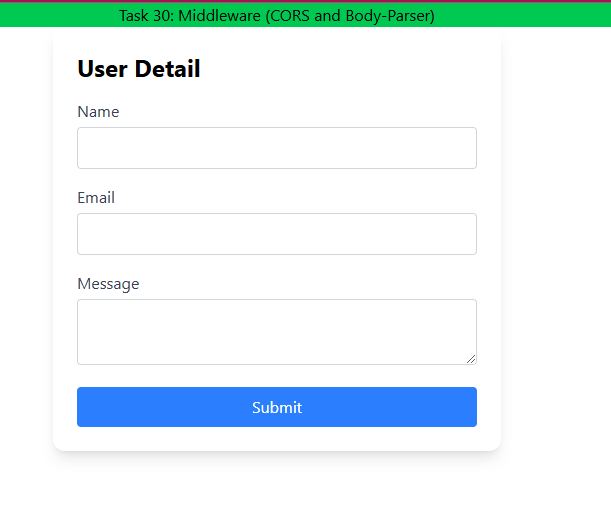

# Task 30: Middleware (use of CORS and body-parser)

# Frontend in React using tailwind CSS
use useState hook for state management
and axios for sending/receiving data from frontend to backend  

# Backend using Node and Express 
for CORS realted issue use app.use(cors())
for body-parser use app.use(express.json());
